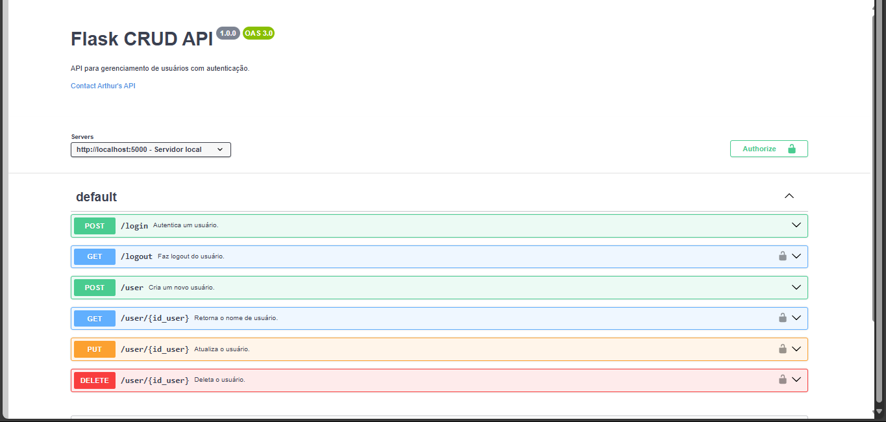

# Autenticação Simples Python

Uma API que contém um CRUD de usuário, mas o foco principal é na parte de Autenticação do usuário e também a criptografia de senhas.

  <a href="#-tecnologias">Tecnologias</a>

 

  

## 🚀 Tecnologias

Esse projeto foi desenvolvido com as seguintes tecnologias:

- Python
- Flask
- Flask-SQLAlchemy
- Bcrypt