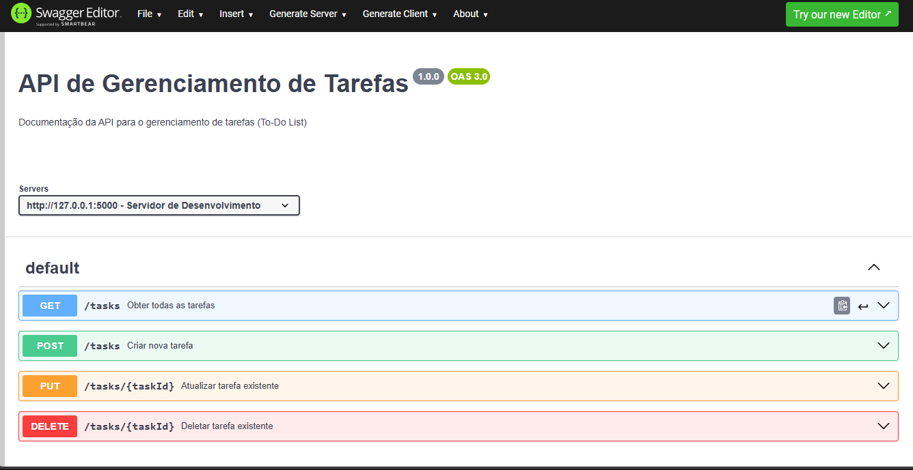

# API de Gerenciamento de Tarefas

Projeto de uma API CRUD com Flask de um gerenciamento de tarefas, com testes feito com Pytest

  <a href="#-tecnologias">Tecnologias</a>

 

  

## 🚀 Tecnologias

Esse projeto foi desenvolvido com as seguintes tecnologias:

- Python
- Flask
- Pytest